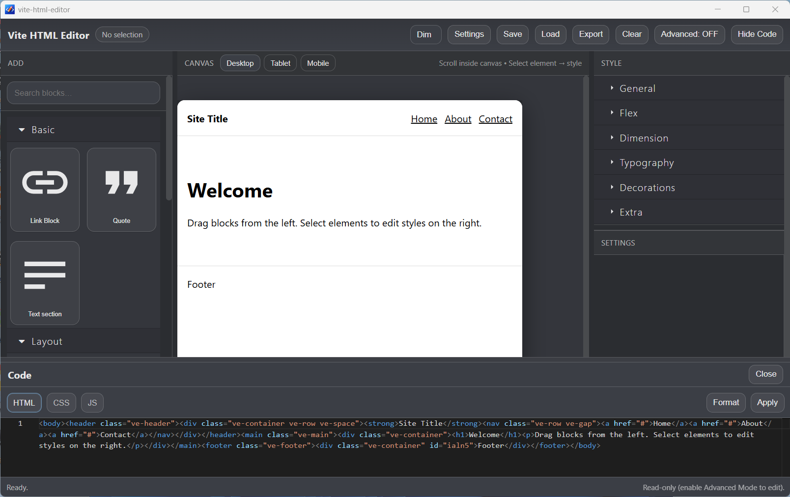

# Vite HTML Editor

*A Visual + Code Web Layout Editor built with React, Vite, GrapesJS and Electron*

## Overview

This project is a hybrid **visual + code HTML editor** built as a personal exploration of:

- Layout systems (Flexbox & Grid)

- Drag-and-drop visual editing

- HTML/CSS extraction

- Electron desktop packaging

- Vite + React architecture

It allows users to design responsive web pages visually, inspect generated HTML/CSS, and export the result. The project also runs as a packaged desktop application.

This repository serves as a completed portfolio project and technical milestone.

---

## Screenshot

## Features

- Drag-and-drop layout editing (GrapesJS engine)

- Responsive preview (Desktop / Tablet / Mobile)

- Layout helper tools (Flex / Grid / Alignment / Gap)

- Undo / Redo / Duplicate / Delete controls

- Custom HTML `<head>` injection

- Custom JavaScript support

- HTML & CSS extraction

- Electron desktop build (.exe)

- Custom application icon

---

## Tech Stack

Frontend:

- React

- TypeScript

- Vite (Rolldown variant)

Editor Engine:

- GrapesJS

Desktop Packaging:

- Electron

- electron-builder

---

## Project Structure

├── src/                # React application  
│   ├── canvas/         # Canvas + toolbar components  
│   ├── editor/         # GrapesJS initialization  
│   └── ...  
├── electron/           # Electron main & preload scripts  
├── build/              # Application icon resources  
├── dist/               # Vite production output (generated)  
├── electron-dist/      # Compiled Electron scripts (generated)  
└── package.json

---

## Installation

Clone the repository and install dependencies:

git clone <your-repo-url>  
cd vite-html-editor  
npm install

---

## Run in Development (Browser)

npm run dev

Open:

http://localhost:5173

---

## Run as Electron App (Development Mode)

npm run dev

Electron automatically connects to the Vite dev server.

---

## Build Web Version

npm run build

Output folder:

/dist

---

## Build Desktop Installer (.exe)

npm run dist

The generated installer will appear in the configured output directory (e.g., `/release`).

---

## Motivation

This project was built to explore:

- Visual layout control in modern web development

- Responsive layout systems

- Hybrid visual/code workflows

- Desktop packaging of web applications

While many modern tools and AI systems can generate HTML automatically, this project focused on understanding layout mechanics and building a refinement-based editing experience.

---

## Status

This project is considered complete as a portfolio exploration and is not currently under active feature development